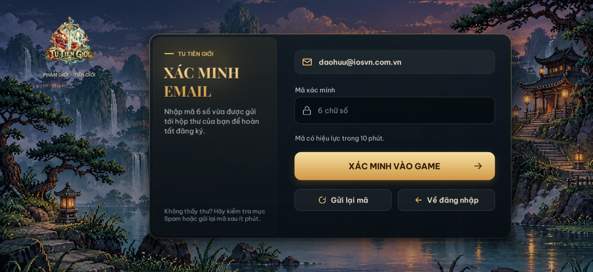

# Tu Tiên Giới (iOS & Dedicated Server)

Dự án game nhập vai tu tiên đồ hoạ Pixel phong cách Thuỷ mặc (QCBH) trên nền tảng **Unity (iOS)** và máy chủ **Node.js Dedicated Server**. Lõi luật chơi được đồng bộ hoá hoàn chỉnh từ bản AWS sang `ipa_core/`. Hệ thống API độc lập phục vụ riêng cho client iOS chạy tại `https://tutien.iosvn.com.vn/ipa/api`.

---

## 🌟 Tính năng nổi bật

### 1. Bản đồ Thế giới & Thần hành Phi hành
- **19 Châu rộng lớn (256×160 ô):** Mỗi châu được bao quanh bởi rặng núi biên giới khép kín. Người tu tiên đi bộ sẽ bị núi cao, sông sâu và rừng rậm ngăn lối.
- **Phi kiếm & Tọa kỵ (Ngự không):** Trang bị vào ô `phiKiem` cho phép bay lượn trên không trung, tạo vệt tiên khí, tăng tốc độ di chuyển và vượt qua địa hình sông núi nội châu.
- **Thành thị & Kỳ ngộ:** Các đại thành cổ kính có cổng thành, bên trong có giao dịch, truyền tống trận, bảng xếp hạng và gặp gỡ tu sĩ khác.
- **Quái tuần tra & Boss thế giới:** Yêu thú di chuyển tự do khắp nơi trên bản đồ theo cảnh giới tu vi.

### 2. Chiến đấu Pixel thời gian thực (PvE & PvP)
- **Hiệu ứng ngũ hành & Tiên pháp:** 240+ hiệu ứng kỹ năng ngũ hành mượt mà (kiếm khí, cự kiếm thiên giáng, thần long, đài sen, bát quái trận, luân hồi bảo luân, lôi kiếp).
- **Yêu thú sinh động:** 279 loài yêu thú có hình thể, động tác thở, tung chiêu và trúng đòn riêng biệt. Mỗi quái sở hữu 5 tuyệt kỹ độc môn telegraphed bằng tên chiêu.
- **Vật phẩm trợ chiến:** Sử dụng đan dược và phù chú ngay trong trận (Hồi Xuân Đan hồi khí huyết, Hồi Linh Đan hồi linh lực, Phù Định Thân làm choáng đối thủ).
- **Cơ chế chiến đấu kép:** Di chuyển linh hoạt né đòn cảnh báo, tấn công chủ động bằng tay hoặc kích hoạt chế độ tự động xuất chiêu theo thời gian hồi (cooldown).

### 3. Tùy biến Nhân vật & Trang bị
- **Dựng hình đa tầng (Avatar3):** Nhân vật ghép từ 17 danh mục (khuôn mặt, kiểu tóc, y phục, vũ khí, hào quang tiên giới, tọa kỵ). Hiển thị trực quan món vũ khí và chiến bào đang mang trên người.
- **Zoom cận cảnh tạo hình:** Giao diện cuộn giấy cổ phong tự động phóng to gương mặt khi chọn ngũ quan và kiểu tóc, giúp người chơi quan sát từng nét vẽ pixel tinh tế.
- **Túi đồ thông minh:** 10 ô trang bị quanh nhân vật, phân màu theo phẩm cấp, hỗ trợ lọc danh mục và bảng so sánh thuộc tính nhanh khi thay đồ.

### 4. Hệ thống Đăng nhập & Bảo mật
- Giao diện thẻ kính mờ tối màu hiện đại, tối ưu tỉ lệ hiển thị trên cả điện thoại màn hình dọc/ngang lẫn iPad.
- Đăng nhập/Đăng ký tài khoản tức thì, xác minh bảo mật email qua mã OTP 6 số.

---

## 📸 Hình ảnh giao diện

### Đăng nhập & Tạo tài khoản




### Chiến đấu Pixel PvE


---

## 📁 Cấu trúc Dự án

```text
├── .github/workflows/          # CI/CD tự động build iOS IPA và test máy chủ
│   ├── build-ios.yml           # Pipeline build Unity, xuất Xcode và đóng gói IPA
│   └── prepare-lcsign-ipa.yml  # Pipeline ký ad hoc phục vụ cài qua LCSign
├── ipa_core/                   # Lõi luật chơi, dữ liệu catalog, quái vật, kỹ năng
├── unity_project/              # Dự án client Unity (phiên bản 6000.6.3f1)
│   ├── Assets/
│   │   ├── Editor/             # Các công cụ xuất iOSBuild, preview, import
│   │   ├── Resources/
│   │   │   ├── Art/            # Texture quái vật, kỹ năng và icon phân giải cao
│   │   │   ├── Avatar3/        # Dữ liệu lớp pixel nhân vật & tiên khí
│   │   │   ├── PixelArt/       # Bộ pixel art nguyên bản (Monsters, Items, UI)
│   │   │   └── World/          # Dữ liệu 19 map châu và cấu trúc thành phố
│   │   ├── Scenes/             # Scene chính: OnlinePrototype.unity
│   │   └── Scripts/Core/       # Mã nguồn C# điều khiển gameplay, UI và mạng
│   └── docs/                   # Tài liệu chi tiết và ảnh minh hoạ
├── tests/                      # Bộ kiểm thử tự động API và hệ thống (14 bài test)
├── ipa_server.js               # Máy chủ độc lập Node.js cho tài khoản & gameplay
└── Dockerfile                  # Container triển khai máy chủ lên GitHub Packages
```

---

## 🎮 Cách chơi & Trải nghiệm

### 1. Chơi Ngoại tuyến (Offline PVE)
- Chọn nút **CHƠI NGOẠI TUYẾN** hoặc **THỬ TẠO NHÂN VẬT** ngay tại màn hình đầu tiên mà không cần tạo tài khoản.
- Toàn bộ dữ liệu 19 châu, săn quái dã ngoại, vượt ải và thu thập chiến lợi phẩm được lưu trữ cục bộ trên thiết bị.

### 2. Chơi Trực tuyến (Online MMO)
- Đăng ký tài khoản nhanh hoặc qua xác thực email.
- Trải nghiệm tính năng PvP Đấu trường, chợ giao dịch, trò chuyện và cùng tu luyện với cộng đồng tu sĩ.

---

## 🚀 Hướng dẫn Build & Tải file IPA

### 1. Tải bản IPA mới nhất
Vào mục **[Releases](https://github.com/iOSVNNews/iosvn-unity-game/releases)** của repository:
- Tải file `TuTienGioi-unsigned.ipa` từ release mới nhất.
- Cài đặt lên iPhone/iPad thông qua các công cụ ký chứng chỉ phổ biến như **ESign**, **Scarlet**, **TrollStore** hoặc **AltStore/Sideloadly**.
- Hệ thống tự động dọn dẹp các bản release cũ, chỉ giữ lại 2 phiên bản mới nhất để tránh đầy bộ nhớ.

### 2. Kích hoạt Build tự động trên GitHub Actions
Mở tab **Actions** → chọn **Tu Tiên Giới iOS build** → bấm **Run workflow**:
- **Mặc định:** Pipeline đã được cấu hình sẵn chế độ `use_prebuilt_xcode=true`, `export_ipa=true` và `publish_release=true`. Bạn chỉ cần bấm nút **Run workflow** mà không cần điều chỉnh tham số.
- Workflow sẽ tự động tải bản xuất Xcode mới nhất, biên dịch mã nguồn qua máy ảo macOS runner, đóng gói IPA và tạo ngay một bản Release mới.
- Đối với trường hợp cài đặt bằng **LCSign**, chạy tiếp workflow **Prepare IPA for LCSign** để được cấp chữ ký ad hoc thay thế.

---

## ⚙️ Cấu hình Máy chủ (Dành cho Quản trị viên)

Chạy máy chủ qua Docker:
```sh
docker run -d --name iosvn-ipa-server \
  --env-file ipa_server.env \
  -p 8788:8788 \
  -v iosvn-ipa-data:/data \
  ghcr.io/iosvnnews/iosvn-ipa-server:latest
```

Kiểm tra API cục bộ:
```sh
npm test
```
