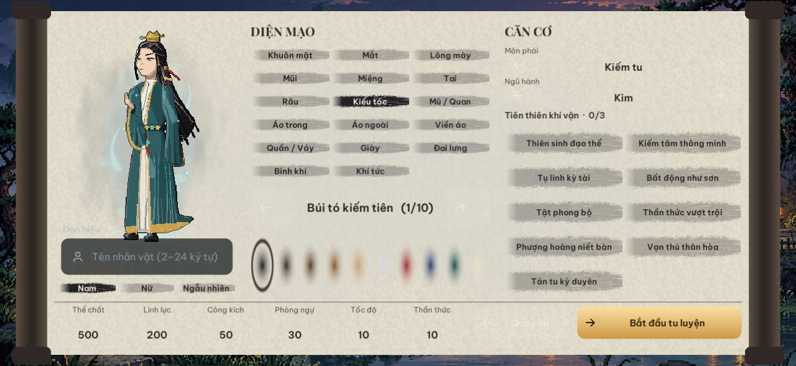
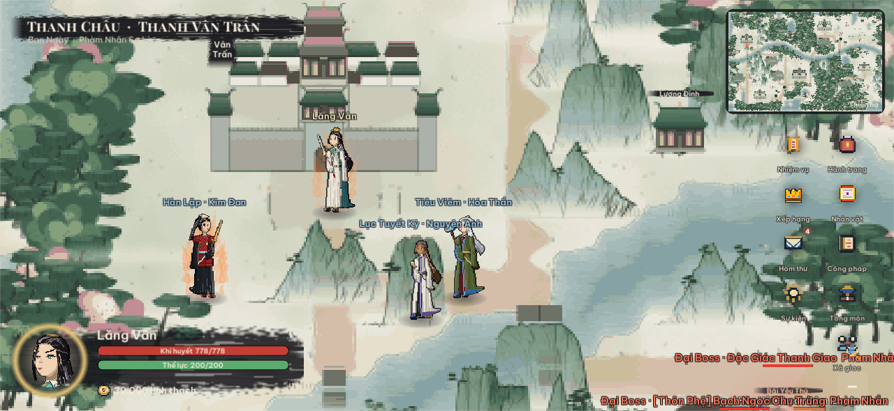
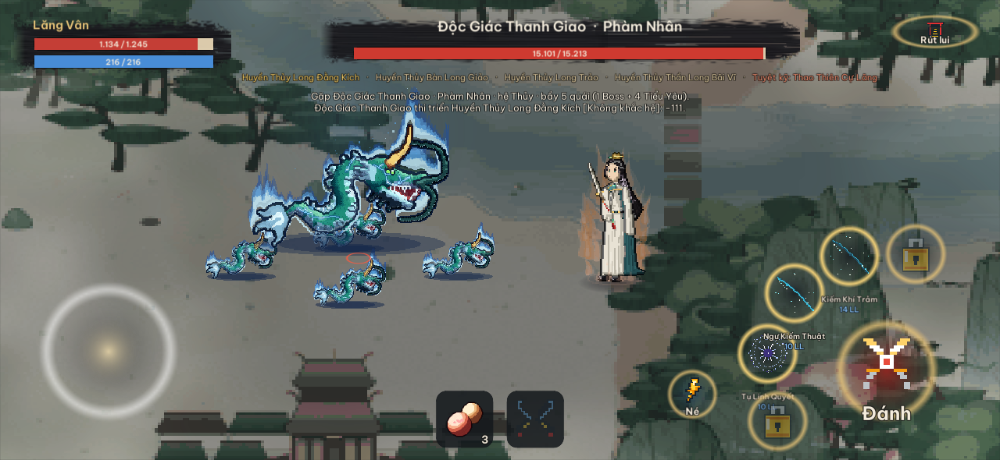
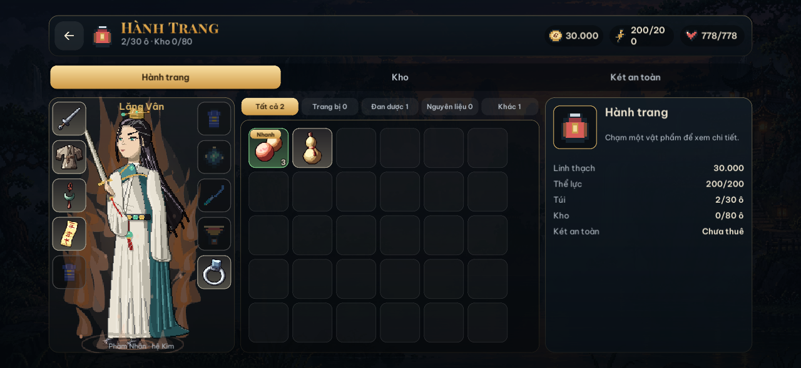

# 🌟 Tính năng nổi bật

### 1. Bản đồ Thế giới & Thần hành Phi hành
- **19 Châu rộng lớn (256×160 ô):** Mỗi châu được bao quanh bởi rặng núi biên giới khép kín. Người tu tiên đi bộ sẽ bị núi cao, sông sâu và rừng rậm ngăn lối.
- **Phi kiếm & Tọa kỵ (Ngự không):** Trang bị vào ô `phiKiem` cho phép bay lượn trên không trung, tạo vệt tiên khí, tăng tốc độ di chuyển và vượt qua địa hình sông núi nội châu.
- **Thành thị & Kỳ ngộ:** Các đại thành cổ kính có cổng thành, bên trong có giao dịch, truyền tống trận, bảng xếp hạng và gặp gỡ tu sĩ khác.
- **Quái tuần tra & Boss thế giới:** Yêu thú di chuyển tự do khắp nơi trên bản đồ theo cảnh giới tu vi.

### 2. Chiến đấu Pixel thời gian thực (PvE & PvP)
- **Hiệu ứng ngũ hành & Tiên pháp:** 240+ hiệu ứng kỹ năng ngũ hành mượt mà (kiếm khí, cự kiếm thiên giáng, thần long, đài sen, bát quái trận, luân hồi bảo luân, lôi kiếp).
- **Yêu thú sinh động:** 279 loài yêu thú có hình thể, động tác thở, tung chiêu và trúng đòn riêng biệt. Mỗi quái sở hữu 5 tuyệt kỹ độc môn telegraphed bằng tên chiêu.
- **Vật phẩm trợ chiến:** Sử dụng đan dược và phù chú ngay trong trận (Hồi Xuân Đan hồi khí huyết, Hồi Linh Đan hồi linh lực, Phù Định Thân làm choáng đối thủ).
- **Cơ chế chiến đấu kép:** Di chuyển linh hoạt né đòn cảnh báo, tấn công chủ động bằng tay hoặc kích hoạt chế độ tự động xuất chiêu theo thời gian hồi (cooldown).

### 3. Tùy biến Nhân vật & Trang bị
- **Dựng hình đa tầng (Avatar3):** Nhân vật ghép từ 17 danh mục (khuôn mặt, kiểu tóc, y phục, vũ khí, hào quang tiên giới, tọa kỵ). Hiển thị trực quan món vũ khí và chiến bào đang mang trên người.
- **Zoom cận cảnh tạo hình:** Giao diện cuộn giấy cổ phong tự động phóng to gương mặt khi chọn ngũ quan và kiểu tóc, giúp người chơi quan sát từng nét vẽ pixel tinh tế.
- **Túi đồ thông minh:** 10 ô trang bị quanh nhân vật, phân màu theo phẩm cấp, hỗ trợ lọc danh mục và bảng so sánh thuộc tính nhanh khi thay đồ.

### 4. Hệ thống Đăng nhập & Bảo mật
- Giao diện thẻ kính mờ tối màu hiện đại, tối ưu tỉ lệ hiển thị trên cả điện thoại màn hình dọc/ngang lẫn iPad.
- Đăng nhập/Đăng ký tài khoản tức thì, xác minh bảo mật email qua mã OTP 6 số.

---

## 📸 Hình ảnh giao diện

### 1. Màn hình Khởi đầu & Đăng nhập

### 2. Tạo hình Nhân vật Đa tầng

### 3. Khám phá Thế giới 19 Châu

### 4. Chiến đấu Yêu thú Thời gian thực

### 5. Hành trang & Trang bị Nhân vật

---

## 🎮 Cách chơi & Trải nghiệm

### 1. Chơi Ngoại tuyến (Offline PVE)
- Chọn nút **CHƠI NGOẠI TUYẾN** hoặc **THỬ TẠO NHÂN VẬT** ngay tại màn hình đầu tiên mà không cần tạo tài khoản.
- Toàn bộ dữ liệu 19 châu, săn quái dã ngoại, vượt ải và thu thập chiến lợi phẩm được lưu trữ cục bộ trên thiết bị.

### 2. Chơi Trực tuyến (Online MMO)
- Đăng ký tài khoản nhanh hoặc qua xác thực email.
- Trải nghiệm tính năng PvP Đấu trường, chợ giao dịch, trò chuyện và cùng tu luyện với cộng đồng tu sĩ.
