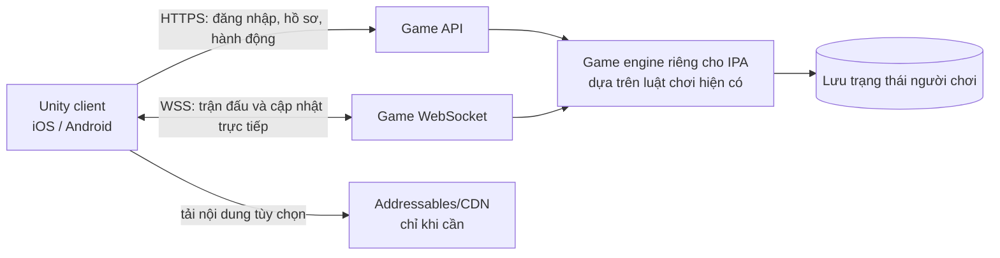

# Tu Tiên iOSVN — Unity online cho iOS

**Ghi nhận ngày 30/09/2026.** Bản game đang chạy trên AWS là nguồn luật chơi và nội dung cho bản Unity. Server IPA sẽ chạy riêng, dùng tài khoản email độc lập và save riêng; Mini App Telegram giữ nguyên. Unity Hub 3.22.0 hiện có trên máy, nhưng chưa tìm được Unity Editor cài kèm.

## Mục tiêu và hướng đề xuất

Mục tiêu là làm **client Unity thật** cho game online. Game AWS cung cấp nền móng về luật chơi và nội dung; server dành riêng cho IPA sẽ quản lý tài khoản email, nhân vật, vật phẩm, tiền tệ, chiến đấu, rơi đồ và lưu tiến trình. Unity phụ trách giao diện, điều khiển cảm ứng, bản đồ/trận đánh và kết nối tới server riêng.

Chuyển game web thành Unity không phải là chuyển đổi tự động HTML/CSS/JavaScript sang C#. Cần viết lại phần giao diện/trình bày trong Unity, đồng thời giữ hợp đồng API và luật game ở server. Không nên đưa `botToken`, khóa dịch vụ hoặc quyền tự sửa dữ liệu nhân vật vào ứng dụng.

## App đã kiểm tra: `D:\Telegram\Payload\App.app`

Thư mục này chứa bundle iOS đã đóng gói có tên **Tu Tiên 2D**, phiên bản `1.0.10`, bundle ID `com.tuvi.phamnhan`, yêu cầu iOS 15 trở lên. Dung lượng bundle trên máy lúc kiểm tra khoảng **160,5 MiB** (752 tệp); đây chỉ là số đo của app tham khảo, không phải ước tính dung lượng game Unity của dự án này. Trang HTML trong app ghi tên Tu Tiên 2D Online và domain chuẩn `tutien2d.online`.

### Cấu trúc và điều đáng học

- Đây là app native iOS dùng **Capacitor và Cordova** để đóng gói nội dung web trong thư mục `public/`; bundle có framework native, file thực thi iOS và các trang HTML/CSS/JavaScript. Nó **không phải project Unity**.
- Phần game 2D pixel được chia thành các module JavaScript: vòng lặp/game, renderer, input/cảm ứng, scene/bản đồ, entity, hệ thống vật phẩm/kỹ năng, UI, auth, mạng và lưu cloud. Một số điểm vào có thể xem trong `D:\Telegram\Payload\App.app\public\src\main.js` và các thư mục con `src\core`, `src\net`, `src\scenes`, `src\systems`, `src\ui`, `src\world`.
- Mã client có luồng đăng nhập, gateway/WebSocket, lưu cloud, giao diện cảm ứng, xoay màn hình và scale UI. Đây là các yêu cầu thực tế của app mobile online, dù client trong bundle được viết bằng web technology.
- Có thể dùng app này làm tài liệu tham khảo về bố cục/luồng thao tác sau khi tự trải nghiệm trên thiết bị; tệp hiện có không phải source project Unity để mở và build lại.

**Quyền sử dụng:** bundle không cung cấp giấy phép mã nguồn/tài sản trong các tệp đã kiểm tra. Hãy xem app là tài liệu tham khảo về cách đóng gói và UX; không chép mã, hình, âm thanh, logo, tên thương hiệu hay nội dung sang game của mình nếu chưa xác nhận quyền sử dụng.

## Hiện trạng `D:\game_iosvn`

### Phần game web và server

- [`engine.js`](engine.js) và [`catalog.js`](catalog.js) chứa luật game và danh mục nội dung.
- [`server.js`](server.js) cung cấp REST API và WebSocket `/ws`; REST hiện xác thực Telegram Mini App bằng `x-init-data` đã ký. API trả trạng thái game đầy đủ qua `/api/state`; các thao tác game được gửi lên server để xử lý.
- [`index.js`](index.js) gắn game vào bot hiện có và khởi tạo server. [`store.js`](store.js) lưu trạng thái game trong tệp JSON với ghi gộp và thay thế tệp nguyên tử.
- `public/` có các client web khác nhau, trong đó `index.html` dùng Mini App Telegram còn `qc_game.html` là một giao diện game 2D riêng. [`CHAY_GAME.bat`](CHAY_GAME.bat) chạy `standalone_server.js`; file này phục vụ trang/bridge và API bridge, không phải bộ tích hợp bot/game giống `index.js`.
- Root hiện **không có thư mục `.git`**. Nên đưa mã, Unity project và tài liệu vào quản lý phiên bản trước khi bắt đầu thêm nhiều scene/tài nguyên.

### Hai bản mã game hiện không đồng nhất

Mã game gốc trong `D:\game_iosvn` vẫn là nhánh Mini App riêng. Lõi dành cho IPA đã được sao chép từ bản AWS đang chạy sang [`ipa_core`](ipa_core/), với hash nguồn ghi trong [`PROVENANCE.md`](ipa_core/PROVENANCE.md). API email và save vẫn tách biệt; Unity không gọi service AWS như máy chủ production.

## Hiện trạng Unity

`unity_project` hiện có cấu hình project Unity 6.3 LTS, client email/API ban đầu, UI prototype được tạo lúc chạy và script sinh scene/build list khi project mở trong Unity. Scene và `.meta` do Unity tạo khi import. Chưa xác nhận compile vì Unity Editor chưa được tìm thấy. Workflow GitHub Actions nằm ở [build-ios.yml](.github/workflows/build-ios.yml); workflow xuất Xcode project, còn bước ký IPA cần Unity license và Apple signing secrets.

`ipa_server.js` và `email_auth_store.js` hiện là bản đầu tiên của server IPA riêng, với email auth, dữ liệu người chơi độc lập, truy tung mục tiêu và API chiến đấu cơ bản. Nó chỉ là mã nguồn cục bộ; chưa được deploy, cấu hình domain/HTTPS, và chưa được Unity compile để xác nhận kết nối.

Yêu cầu map Phàm Giới/Tiên Giới, cổng, giới hạn hành trình 30 phút, tùy biến profile, pixel art gốc và hệ thống bạn bè được ghi thành thiết kế triển khai tại [`GAME_DESIGN_DIRECTION.md`](unity_project/docs/GAME_DESIGN_DIRECTION.md). Các hệ thống này chưa có trong prototype.

Workflow [`build-ios.yml`](.github/workflows/build-ios.yml) xuất project Xcode mỗi khi push/PR có thay đổi Unity hoặc lõi game. Job build sẽ tự bỏ qua và ghi thông báo nếu chưa có secret `UNITY_LICENSE`. Chạy workflow thủ công với `export_ipa=true` để ký IPA; thao tác này cần thêm Apple certificate/provisioning profile và GitHub Actions Variables `IOS_BUNDLE_ID`, `IPA_SERVER_URL`.

| Tệp hiện có | Hiện trạng khi đọc mã | Việc còn thiếu |
|---|---|---|
| [`NetworkGameClient.cs`](unity_project/Assets/Scripts/Core/NetworkGameClient.cs) | REST client dùng URL cấu hình được, email login/register/logout, tạo nhân vật, tải mục tiêu, xem trận và gửi thao tác chiến đấu. | Chưa compile trong Unity; URL server riêng chưa được cung cấp. |
| [`AssetDownloadManager.cs`](unity_project/Assets/Scripts/Patching/AssetDownloadManager.cs) | Prototype tải manifest và file bundle vào persistent storage. | Chưa có manifest/CDN/Addressables Unity trong project. `md5` và `isRequired` khai báo nhưng chưa áp dụng; tải tiếp dùng Range/append mà chưa xác nhận server trả HTTP 206; kiểm tra tệp chủ yếu theo kích thước; chưa nạp bundle vào game. Không dùng nguyên trạng cho phát hành. |
| [`DestinySystem.cs`](unity_project/Assets/Scripts/Cultivation/DestinySystem.cs) | Mẫu local cho 10 cảnh giới và một số thiên phú. | Chưa nối catalog, trạng thái hoặc luật server hiện tại; không đại diện đầy đủ hệ thống game đang chạy. |
| [`BatHoangMapManager.cs`](unity_project/Assets/Scripts/Map/BatHoangMapManager.cs) | Mẫu tạo lưới và vài tile/bản đồ minh họa. | Chưa có scene/rendering, di chuyển đồng bộ server, nội dung đủ vùng hoặc tải bản đồ. |
| [`DestructibleEnvironment.cs`](unity_project/Assets/Scripts/Combat/DestructibleEnvironment.cs) | Mẫu cục bộ cho cây/đá có thể phá. | Chưa nối với chiến đấu/rơi đồ do server quyết định. |

`unity_project/README_UNITY_IPA.md` trước đây nêu dung lượng IPA, CDN, gói AssetBundle, cấu hình bundle ID và phiên bản iOS như thể đã chốt. Hiện đó là **ước tính/ý tưởng**, chưa có build, nội dung bundle, manifest hay CDN tương ứng. File đó đã được đổi thành ghi chú trạng thái và dẫn về README ở thư mục gốc này; cần đo dung lượng sau khi có bản Unity đầu tiên.

## Các repo tham khảo

| Repo | Có ích ở điểm nào | Giới hạn/quyền sử dụng cần lưu ý |
|---|---|---|
| [szylover/xiuxian-unity](https://github.com/szylover/xiuxian-unity) | Gần mục tiêu chuyển một game tu tiên web sang Unity. Có project Unity đầy đủ, chia lớp dữ liệu/game logic/UI và có `LogicTests`; README ghi MIT. | Theo README dùng Unity 6000, tập trung bản Windows và game đơn; không chứng minh client iOS/Android online. Dùng để tham khảo cách tổ chức/port và test, không giả định mọi tính năng đã hoàn thiện. |
| [liuhaopen/UnityMMO](https://github.com/liuhaopen/UnityMMO) | Mẫu Unity MMO có client/server tách riêng; README ghi client Windows/Android/iOS, server Linux; dùng Lua cho UI và Skynet phía server. Repo ghi MIT. | Dự án cũ, README ghi Unity 2019.4.28f1. Tài nguyên và một số plugin nằm ngoài repo hoặc có điều kiện bản quyền; không lấy chúng mặc nhiên. |
| [lianglllll/MMORPG-Server](https://github.com/lianglllll/MMORPG-Server) | Chủ đề tu tiên online, có Unity client và server C#, công cụ dữ liệu/protobuf/MySQL; tham khảo danh sách hệ thống MMO và ranh giới client/server. | README tự ghi đang chuyển kiến trúc, phần lớn logic chưa sửa xong. Không thấy giấy phép ở danh sách file gốc khi kiểm tra; chỉ tham khảo, chưa sao chép code/tài nguyên. |
| [th000cw02-afk/xiuxianguaji](https://github.com/th000cw02-afk/xiuxianguaji) | Tham khảo build mobile iOS/Android bằng Capacitor, giao diện nhỏ màn hình và tài liệu phát hành; repo ghi MIT. | Game đơn, dùng WebView và lưu cục bộ; không phải kiến trúc Unity hay server-authoritative MMO. |
| [flyarong/FanRen-unity](https://github.com/flyarong/FanRen-unity) | Có thể tham khảo ý tưởng game RPG tu tiên và cách tổ chức một project Unity lớn hơn. | README của tác giả nói code/tài nguyên không được dùng cho mục đích thương mại. Chỉ đọc tham khảo, không tái sử dụng code, hình, model hay âm thanh trong sản phẩm. |

Repo và điều khoản có thể thay đổi. Trước khi lấy bất cứ code, font, âm thanh hay art nào, kiểm tra `LICENSE` của đúng repo/nhánh và giấy phép riêng của từng asset/plugin. “Có trên GitHub” không tự động có nghĩa là được dùng trong game phát hành.

## Kiến trúc tích hợp nên nhắm tới

1. **Unity không quyết định kết quả kinh tế/chiến đấu.** Client gửi ý định như đánh, dùng vật phẩm, di chuyển hoặc mua; server kiểm tra điều kiện, cập nhật dữ liệu và trả kết quả. Không chấp nhận số linh thạch, vật phẩm rơi, sát thương hoặc HP do client tự khẳng định.
2. **Dùng HTTPS/WSS công khai với TLS.** Không đưa `localhost`/`127.0.0.1` vào build mobile. Cũng không nhúng bot token hay khóa quản trị vào app.
3. **Làm rõ đăng nhập trước khi port tính năng.** `x-init-data` chỉ có khi mở game trong Telegram. App riêng cần một luồng xác thực native/token do server cấp, có thời hạn và thu hồi được, đồng thời phải ánh xạ về đúng tài khoản hiện tại để giữ nhân vật. Không thay bằng `userId` tự gửi từ client.
4. **Chốt hợp đồng dữ liệu.** Tạo DTO C# cho state, nhân vật, inventory, battle, market và lỗi API. Kiểm thử việc parse các response thật; không dùng DTO `PlayerProfileData` vài trường làm toàn bộ model.
5. **Chọn giao thức cho mỗi loại cập nhật.** REST phù hợp đăng nhập, hồ sơ và hành động ít cập nhật; WebSocket phù hợp trận đánh/nhóm/cập nhật live. Cần thiết kế reconnect, timeout, phiên hết hạn và xử lý response lặp.
6. **Để đồ họa tải động thành giai đoạn sau.** Khi đã có project và asset thật, đánh giá Unity Addressables với remote catalog/bundle, version, hash/integrity, retry và cache. Unity mô tả remote catalog là cơ chế để client tải bản nội dung thay đổi mà không phát hành lại toàn bộ app. Hiện chưa có lý do để chốt tổng dung lượng 1–3 GB hay hứa một CDN chưa được dựng.

## Lộ trình khuyến nghị

### 0. Chốt nguồn sự thật và tài khoản

- Chọn bản server production hiện tại làm chuẩn; thống kê route, response, WS message và vị trí lưu hồ sơ.
- Quyết định đăng nhập qua Telegram, Apple/native hoặc liên kết nhiều phương thức; xác định cách người đang chơi web giữ nguyên tài khoản/nhân vật.
- Viết API contract có ví dụ response đã ẩn dữ liệu cá nhân và một tài khoản test an toàn.

### 1. Tạo Unity project mở được và build được

- Chọn **một phiên bản Unity LTS** sau khi kiểm tra yêu cầu plugin/platform, rồi ghi cố định vào `ProjectSettings/ProjectVersion.txt`.
- Khởi tạo `Packages/manifest.json`, scene boot/login/game, cấu hình Android/iOS, file `.meta`, input cảm ứng, vùng safe area và xoay màn hình.
- Tách C# thành networking/DTO, game state, presentation/UI và config theo môi trường (local/staging/production).

### 2. Làm một lát cắt online nhỏ

Đăng nhập → tải nhân vật/state → mở một màn chơi → bắt đầu một trận săn → gửi một hành động → nhận kết quả từ server → tải lại app và thấy tiến trình vẫn còn. Sau đó thử cùng tài khoản trên web và Unity, rồi thử hai tài khoản để xác nhận state nhóm/live. Đây là cổng kiểm tra trước khi port hàng loạt màn hình.

### 3. Port tính năng theo ưu tiên

Ưu tiên login/khôi phục, tạo nhân vật, bản đồ và săn yêu, inventory/equipment, tu luyện/đột phá; tiếp theo là tông môn, chợ, tổ đội, Cổ Động, boss và PvP. Mỗi nhóm giữ cùng API và luật server, có kiểm tra reconnect/lỗi/mạng chậm trên thiết bị thật.

### 4. Nội dung và tối ưu mobile

Đo FPS, bộ nhớ, thời gian tải, dung lượng bản cài và dung lượng cache trên một thiết bị Android/iPhone cấu hình mục tiêu. Sau khi có art thật mới chia nhóm nội dung local/remote, chọn nén texture phù hợp thiết bị và triển khai Addressables/CDN. Nếu app cần tải thêm nội dung ngay lần mở đầu, Apple yêu cầu thông báo kích thước và hỏi người dùng trước khi tải.

### 5. Tạo APK và IPA

- **Android:** cần Unity Android Build Support cùng Android SDK, NDK và JDK. Unity Hub có thể cài các thành phần tương thích; Windows có thể tạo APK/AAB.
- **iOS:** Unity tạo Xcode project; build iOS cục bộ cần Xcode trên macOS. Tài liệu Unity nêu Unity Build Automation là lựa chọn nếu máy phát triển không chạy macOS. Phân phối App Store/TestFlight còn cần signing và Apple Developer Program.
- Kiểm tra đăng nhập, mạng thật, đổi app background/foreground, mất kết nối, màn hình tai thỏ, nhiều kích cỡ máy, lưu dữ liệu sau cập nhật và luồng review.

### 6. Điều kiện phát hành iOS cần tính từ sớm

Apple yêu cầu app có tính năng/nội dung/UI tạo trải nghiệm hơn một website đóng gói; nếu cần tải thêm tài nguyên để chạy lần đầu thì phải công bố dung lượng và xin xác nhận. Vì vậy bản phát hành nên có client Unity thực sự, luồng mobile hoàn chỉnh và đủ nội dung để review, thay vì chỉ mở URL game trong WebView. Nếu sau này bán tiền tệ/vật phẩm số trong app, kiểm tra quy tắc In-App Purchase trước khi làm shop native.

## Các điểm cần thống nhất ở buổi làm tiếp

1. Server riêng cho IPA sẽ đặt ở máy/nhà cung cấp nào và domain HTTPS nào?
2. Bản đầu tiên cần đạt vòng chơi nào trước khi làm hết hệ thống?
3. App nhắm tới TestFlight trước hay hướng thẳng tới App Store?
4. CDN/Addressables có cần ngay không, hay chờ sau khi đo dung lượng một build và bộ art thật?

## Nguồn đã tra cứu

- [Unity 6.1 — iOS environment setup](https://docs.unity3d.com/6000.1/Documentation/Manual/ios-environment-setup.html)
- [Unity 6.1 — Android environment setup](https://docs.unity3d.com/6000.1/Documentation/Manual/android-sdksetup.html)
- [Unity Addressables — remote content distribution](https://docs.unity3d.com/Packages/com.unity.addressables@1.21/manual/remote-content-intro.html)
- [Apple App Review Guidelines](https://developer.apple.com/app-store/review/guidelines/uk/), xem mục 3.1 và 4.2
