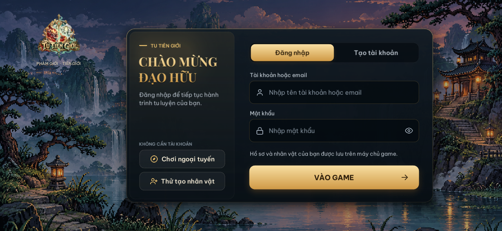
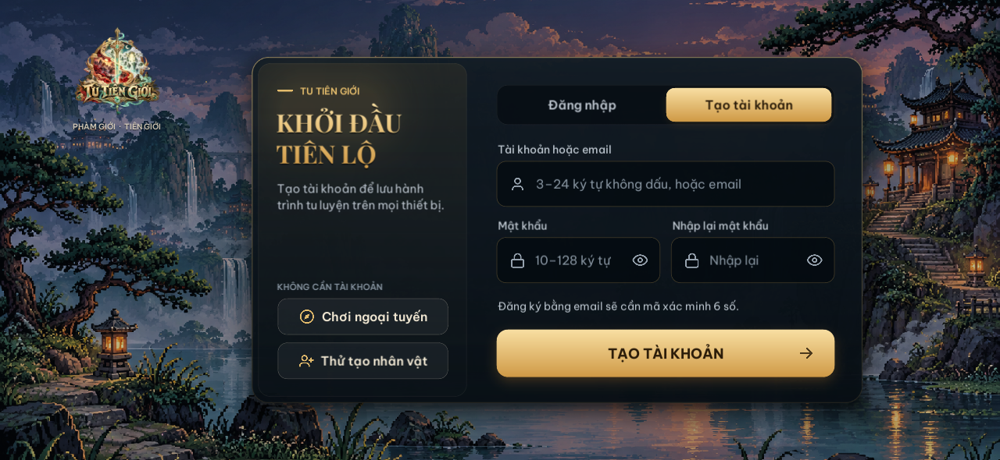
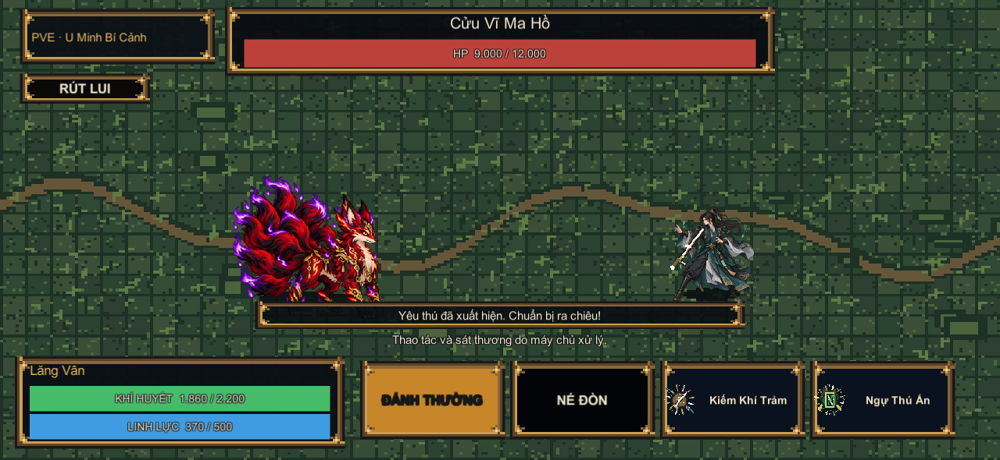
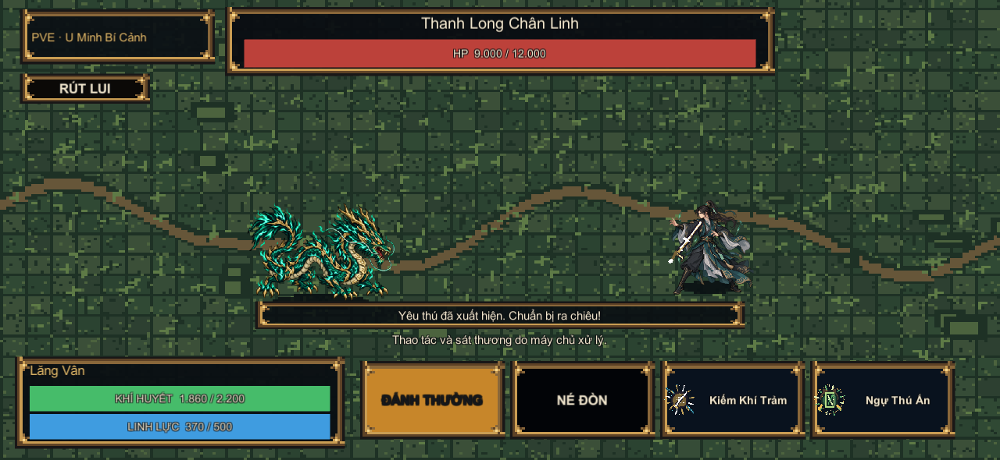

# Tu Tiên Giới

Project Unity online cho iOS. Lõi luật chơi được đồng bộ từ bản AWS sang `ipa_core/`. API IPA đã chạy chung host với bot tại `https://tutien.iosvn.com.vn/ipa/api`, dùng service và kho dữ liệu riêng. Đăng ký/đăng nhập tên tài khoản hoạt động ngay; đăng ký email và liên kết Google/Facebook cần cấu hình dịch vụ tương ứng trên server. Xem [hướng dẫn tài khoản](unity_project/docs/ACCOUNT_SERVER_SETUP.md).

## Trang chủ và tài khoản

Logo nhỏ ở góc trái, nền pixel toàn màn hình có ánh đom đóm chuyển động nhẹ và bảng tài khoản ở giữa. Tab tạo tài khoản mở form riêng có xác nhận mật khẩu; đăng nhập và đăng ký gọi API thật, có kiểm tra dữ liệu và thông báo lỗi. Các ảnh dưới đây được render từ mã Unity hiện tại.




## Pixel chiến đấu PvE

Màn chiến đấu lấy quái theo đúng ID từ catalog, cử động khi đứng, ra đòn và trúng đòn. Vũ khí trên nhân vật lấy theo món đang trang bị; kỹ năng và đòn nguyên tố của từng quái có hình pixel và hiệu ứng chuyển động riêng. Bộ `CombatPixel` hiện phủ 279/279 ID quái, 547/547 ID vũ khí duy nhất và 245/245 ID kỹ năng người chơi. Có thêm 279 hình hiệu ứng theo loài quái và 1.068 hình vật phẩm khác. Năm quái chủ lực được vẽ chi tiết riêng; các ID còn lại được dựng pixel theo dáng loài, màu nguyên tố và hoa văn từng ID. Xem [bảng phủ và giới hạn](unity_project/docs/combat-pixel-coverage.md).




## Build trên GitHub

Mở **Actions** → **Tu Tiên Giới iOS build**. Workflow biên dịch project bằng Unity, sau đó dùng runner macOS và Xcode để tạo bản iOS. Khi dùng Xcode export dựng sẵn, workflow giữ bản export thành Actions artifact trong 90 ngày để không cần công khai release kỹ thuật.

Để khởi tạo artifact Xcode lần đầu, chạy **Tu Tiên Giới iOS build** với `cache_xcode_export_only=true` và `xcode_export_tag=iosvn-xcode-bootstrap`. Mở run vừa chạy, sao chép run ID, rồi chạy lại workflow với:

- `use_prebuilt_xcode=true`
- `xcode_export_run_id=<run ID của workflow cache>`
- `export_ipa=true`
- `publish_release=true`
- `publish_container=true` nếu muốn phát hành server lên GitHub Packages

Mỗi lần build từ artifact sẽ lưu lại Xcode export để làm nguồn cho lần build tiếp theo. IPA unsigned được lưu thành Actions artifact và đính kèm vào Release. Cần ký bằng chứng chỉ và provisioning profile của Apple trước khi cài lên iPhone. Khi đã có license Unity cho CI, đặt `use_prebuilt_xcode=false` để build lại trực tiếp từ `unity_project/`.

### Cấu hình bắt buộc

- Secrets `UNITY_LICENSE`, `UNITY_EMAIL`, `UNITY_PASSWORD` để bật Unity Personal build. `UNITY_LICENSE` là nội dung tệp `.ulf` do Unity Hub kích hoạt cấp; không commit hoặc đính kèm nó vào Release.
- App dùng tên **Tu Tiên Giới** và Bundle ID mặc định `com.iosvn.tutiengioi`; chỉ đặt variable `IOS_BUNDLE_ID` nếu cần ghi đè. Mỗi người ký bằng chứng chỉ riêng phải dùng provisioning profile cho phép Bundle ID này. Profile wildcard tương thích cũng có thể cho phép app mà không cần đăng ký ID tường minh.
- Variable `IPA_SERVER_URL` có thể ghi đè địa chỉ API mặc định `https://tutien.iosvn.com.vn/ipa/api`.
- Biến `ASSET_CDN_URL` là URL HTTPS chứa manifest và AssetBundles; có thể để trống trong bản thử nghiệm.
- Để xuất IPA: secrets `IOS_TEAM_ID`, `IOS_CERTIFICATE_P12_BASE64`, `IOS_CERTIFICATE_PASSWORD`, `IOS_PROFILE_BASE64`.
- Gmail sender for the dedicated server: environment values `GMAIL_SMTP_USER` and `GMAIL_SMTP_APP_PASSWORD`.

Thiếu Unity license thì workflow ghi thông báo và bỏ qua build. Runner macOS của repo private dùng quota phút GitHub Actions và có thể bị tính phí theo gói.

Trên Windows, vào **Unity Hub > Preferences > Licenses > Add > Get a free personal license** để Hub kích hoạt license. Với Personal license, tạo `.ulf` qua Hub; quy trình manual activation `.alf` của Unity chỉ hỗ trợ license ngoài Personal. Khi đã có `.ulf`, thêm nội dung file vào GitHub Actions secret `UNITY_LICENSE`, rồi đặt `UNITY_EMAIL` và `UNITY_PASSWORD` làm secrets riêng. Không gửi mật khẩu qua chat và không đưa file `.ulf` vào Release hoặc Packages.

## GitHub Packages: IPA server

Workflow có thể đóng gói server email riêng trong container và đẩy lên `ghcr.io/iosvnnews/iosvn-ipa-server:unsigned-test`. Container lắng nghe cổng `8788`; gắn volume vào `/data` để giữ tài khoản và nhân vật qua lần khởi động lại. Ví dụ chạy:

```sh
docker run --name iosvn-ipa-server --env-file ipa_server.env -p 8788:8788 -v iosvn-ipa-data:/data ghcr.io/iosvnnews/iosvn-ipa-server:unsigned-test
```

Server IPA này dùng API và tài khoản email riêng. AWS mini app hiện xác thực bằng Telegram; các route `/api/auth/email/*` và `/api/map/catalog` chưa có trên AWS mini app nên không thể dùng URL đó làm backend IPA. Đăng ký email gửi mã xác minh 6 số qua Gmail; cần tạo Google App Password cho mailbox gửi thư rồi đặt vào `GMAIL_SMTP_APP_PASSWORD` trên máy chủ. Không nhúng mật khẩu Gmail vào IPA hoặc Git.

Nút **CHƠI NGOẠI TUYẾN** mở vòng săn quái lưu cục bộ: đi bộ trên map, gặp quái tuần tra, đánh bằng kỹ năng, nhận vật phẩm, tích lũy tu vi và mở thành theo cảnh giới. Đây là chế độ PVE trên thiết bị. Tài khoản và nhân vật online dùng API `/ipa/api`; PVP với người chơi thật cần người chơi khác cùng đăng nhập server IPA.

## Hiện trạng

- Unity project: `unity_project/` (ghim Unity `6000.6.3f1`; Editor và iOS Build Support đã cài trên ổ D của máy phát triển).
- Server IPA: `ipa_server.js`, HTTPS `/ipa/api` trên domain `tutien.iosvn.com.vn`.
- Chế độ săn quái ngoại tuyến đóng gói 19 map, 65 thành, 279 quái và 245 kỹ năng. Màn PvE ưu tiên sprite `CombatPixel` theo ID; hình cũ từ bot chỉ là dự phòng cho ID chưa có trong bộ mới.
- Hồ sơ ngoại tuyến lưu trên thiết bị. Tài khoản online dùng server IPA đã triển khai; liên kết email/Google/Facebook chờ cấu hình dịch vụ của chủ ứng dụng.
- Dữ liệu tài khoản và nhân vật tách riêng khỏi Mini App Telegram; service `iosvn-ipa` lưu dưới `/var/lib/iosvn-ipa`.
- Hướng tích hợp và ghi nhận nguồn AWS nằm trong `unity_project/docs/` và `ipa_core/PROVENANCE.md`.

Để nhập lại pixel art và catalog từ source game Telegram, chạy `node scripts/import_telegram_world_assets.js "D:\\Bot_Danh_Gia_Uy_Tin_Telegram\\tutien"`.

Để build trên GitHub Actions cần cấu hình Unity Personal secrets. Xuất IPA cài trên iPhone còn cần Apple signing secrets và bundle ID khớp provisioning profile.

### Tải tài nguyên sau khi cài

Game kiểm tra `version_manifest.json` khi mở. Gói tải được xác thực bằng SHA-256, lưu trong vùng dữ liệu của ứng dụng và chỉ nạp AssetBundle khi màn chơi yêu cầu. Đặt tên AssetBundle cho nội dung trong Unity rồi chạy `iOSVN > Assets > Build iOS downloadable bundles`; tải toàn bộ thư mục `build/AssetBundles/iOS` lên HTTPS CDN và đặt URL thư mục đó ở biến `ASSET_CDN_URL`. Bản cài hiện chưa có CDN nên sẽ vào nội dung thử nghiệm mà không chờ tải.
